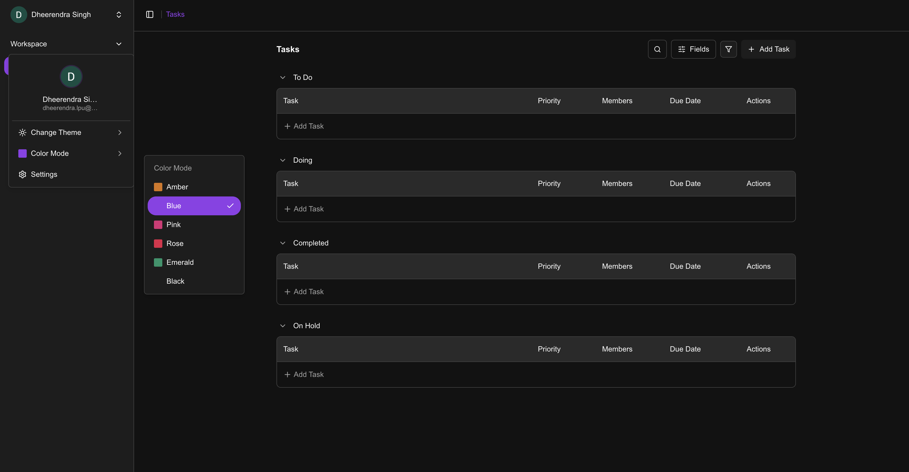

# Task Management System

A responsive task management application built with task organization, filtering, theming, authentication, and multiple viewing options.

## Live Demo

https://my-todo-app-rose-eta.vercel.app

## Features

* Google OAuth authentication
* Guest login with persistent tasks using Local Storage
* Create, update, and delete tasks
* Task status management: To Do, Doing, On Hold, and Completed
* Priority management for tasks
* Multiple task colors
* Task search by name
* Multi-criteria task filtering
* Grid and list view
* Responsive design for desktop, tablet, and mobile
* Light and dark themes with persistent preferences
* Task details page with expanded task information
* User profile and logout functionality
* Persistent theme, color, and guest-task preferences
* Reusable UI components and REST APIs
* Type-safe frontend and backend implementation

## Tech Stack

* **Frontend:** Next.js, TypeScript, Tailwind CSS
* **Backend:** NestJs, TypeScript
* **Database:** PostgreSQL
* **Authentication:** Google OAuth
* **Deployment:** Vercel (Frontend), Render (Backend & Database)
